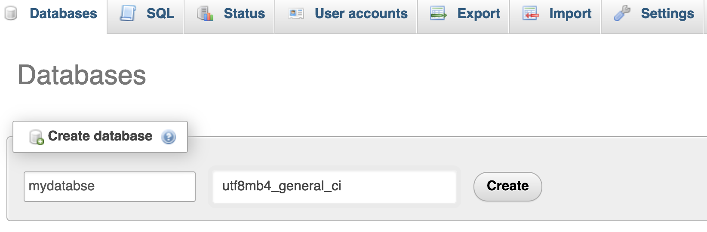

# Web Page with MySQL

## Introduction
This repository provides a step-by-step guide for setting up a PHP and MySQL web application using XAMPP. It's a straightforward tutorial for beginners and a quick setup for seasoned developers to start a local web project.

## Prerequisites
Before you begin, ensure you have XAMPP installed on your system. If you do not have it installed, you can download it from the official XAMPP download page.

## Getting Started
Follow these steps to configure your environment and start working with your MySQL database:

1. Launch XAMPP Control Panel: Open XAMPP and start the Apache and MySQL services.

2. Access the XAMPP Dashboard: Click on the 'Go to Application' button.


3. Navigate to PhpMyAdmin: Click on the 'PhpMyAdmin' button to manage your databases.


4. Create a Database: Establish a new database named mydatabase.


5. Add a Table: Inside your database, create a table with the desired number of columns.


6. Populate the Table: Enter your data into the table using the insert tab.


Here's how your table should look after adding data:


7. Prepare the Application Directory:

- Create a folder named mysql_web within the XAMPP/htdocs directory.

- Alternatively, create a symbolic link to this folder outside of htdocs using the terminal command:

```bash
ln -s /Applications/XAMPP/htdocs ~/Desktop/htdocs_link
```
Note: If you encounter a 500 error, check that file permissions are set to 755, which allows full owner access and read/execute access for others.


8. Set Up PHP Files: Inside your mysql_web folder, create two files: index.php and home.html.

9. Configure Database Connection: Edit the index.php file with the correct database connection parameters. The default settings for XAMPP are:
```php
$servername = "localhost";
$username = "root";  // Your MySQL username
$password = "";      // Your MySQL password
$dbname = "mydatabase";
```

You can verify these settings in PhpMyAdmin under the 'User accounts' tab.
The index.php file is responsible for connecting to the database and displaying its contents.

10. View Your Project: Launch a web browser and navigate to http://localhost/mysql_web/index.php to see your application in action.

The final result should resemble the following page:


## Conclusion
By following this guide, you've set up a local web development environment using XAMPP and created a simple web application that interacts with a MySQL database. This foundation can be built upon for more complex applications, providing a hands-on experience with web technologies.


